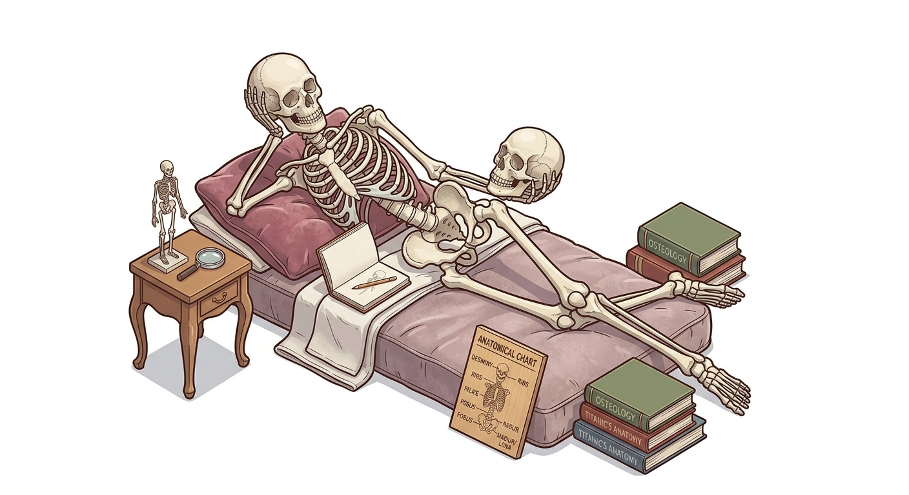

<div align="center">
  

<i>❝Ossa loquuntur, dum carnem expectamus.❞</i>
<br />
<sub>The bones speak while we wait for the flesh.</sub>

[](https://github.com/Wildhoney/Skeleton/actions/workflows/checks.yml)

</div>

> CSS Anchor Positioning skeleton loader for React. Children stay mounted &mdash; shimmer overlays paint exactly over their bounding boxes, no measure-and-redraw.

> **[View Live Demo →](https://wildhoney.github.io/Skeleton/)**

## Contents

1. [Benefits](#benefits)
1. [Getting started](#getting-started)
1. [Palette](#palette)
1. [Resolving the placeholder](#resolving-the-placeholder)
1. [Anchoring deeper](#anchoring-deeper)
1. [Tuning the overlay](#tuning-the-overlay)
1. [Testing](#testing)
1. [Browser support](#browser-support)
1. [API](#api)

## Benefits

- **Zero measurement** &ndash; CSS Anchor Positioning paints the shimmer exactly over each child's box via `position-anchor` + `anchor()`. No `ResizeObserver`, no measured-to-redraw flicker, no width/height props.
- **Children stay mounted** &ndash; the real DOM remains in place (just `aria-hidden` and visually muted), so flipping `resolving` is jank-free &ndash; layout doesn't shift, focus order is preserved, and refs survive the transition.
- **Caller-supplied palette** &ndash; every consumer threads their own design tokens through `palette={{ bone, highlight }}`. No baked-in colour modes to fight with.
- **`levels` for nested layouts** &ndash; descend N levels before anchoring so a flex row's gaps and a grid's tracks stay intact while each leaf gets its own shimmer.
- **Non-element nodes are fine** &ndash; strings, numbers, and fragments are wrapped in an anchored span so the shimmer still lands on them.
- **Accessibility built in** &ndash; anchored elements get `aria-hidden="true"` and `tabIndex={-1}` so screen readers skip the placeholder and keyboard users can't focus dead controls.

## Getting started

Install the package and pass the children you want to mask plus a palette of two colours &ndash; the bone (the still part) and the highlight (the brighter band that sweeps across).

```sh
pnpm add bonework
```

```tsx
import { Bonework } from "bonework";

import { useProfile } from "./hooks";

export function Profile(): React.ReactElement {
  const profile = useProfile();

  return (
    <Bonework
      resolving={profile !== null}
      palette={{ bone: "#edeafd", highlight: "#ddd7fa" }}
    >
      <h1>{profile?.name ?? "Loading"}</h1>
      <p>{profile?.bio ?? "Loading the bio"}</p>
    </Bonework>
  );
}
```

Two things to notice. First, `resolving` is a positive flag &mdash; pass `true` once the data has arrived. Second, the children are the *real* markup, not a skeleton stand-in. The shimmer is painted **over** them.

## Palette

The `palette` prop is the only required colour configuration. Wire it straight to your design tokens so the skeleton stays in step with the rest of the surface:

```tsx
import { Bonework } from "bonework";

import { theme } from "../theme";

<Bonework
  palette={{
    bone: theme.colour.surface.muted,
    highlight: theme.colour.surface.bold,
  }}
>
  ...
</Bonework>;
```

The library deliberately ships no built-in palettes &mdash; bring your own.

## Resolving the placeholder

The component reads `resolving` as a boolean. While it's `false` (default), every child is replaced with an anchored copy plus a shimmering overlay sibling. When it flips to `true`, the children render unmodified:

```tsx
const { data } = useQuery({ queryKey: ["profile"], queryFn });

<Bonework resolving={!!data} palette={tokens}>
  <h1>{data?.name ?? "Loading name"}</h1>
</Bonework>;
```

There's no separate `loading` prop &mdash; `resolving` doubles as the only signal. Pass `true` precisely when you'd otherwise unmount the skeleton.

## Anchoring deeper

By default a single top-level overlay paints over each direct child. For composed layouts &mdash; a flex row, a grid, a card with a header and body &mdash; you usually want each *leaf* shimmering separately while the outer wrapper's gap/grid lines stay intact. Increase `levels`:

```tsx
<Bonework palette={tokens} levels={2}>
  <div className="row">
    
    <div>
      <strong>Name</strong>
      <p>Subline</p>
    </div>
  </div>
</Bonework>
```

`levels={1}` anchors `<div className="row">` (one shimmer over the whole row). `levels={2}` anchors `` and the inner `<div>`. `levels={3}` would descend further. The outer wrappers above the anchored level keep their styling (margins, flex, grid), so the placeholder looks right at every nesting depth.

## Tuning the overlay

Two optional props tweak how the overlay paints:

- `borderRadius` &mdash; the radius applied to the overlay. Defaults to `4`. Number values become `px`; strings pass through (so `"50%"` for circles works).
- `durationMs` &mdash; how long one shimmer pass takes. Defaults to `1400`.

```tsx
<Bonework
  palette={tokens}
  borderRadius="50%"
  durationMs={1000}
>
  <Avatar />
</Bonework>
```

## Testing

The component renders the real DOM, just decorated with `aria-hidden` and anchor styles. Assert by querying for the anchored elements (`style.anchorName` starts with `--sk-`) or the overlay siblings (`aria-hidden="true"`). The library's own suite at [`src/skeleton/index.test.tsx`](./src/skeleton/index.test.tsx) is a good template.

```tsx
import { render } from "@testing-library/react";

const { container } = render(
  <Bonework palette={tokens}>
    <p>Hello</p>
  </Bonework>,
);
const p = container.querySelector("p");
expect((p as HTMLElement).style.anchorName).toMatch(/^--sk-/);
```

## Browser support

CSS Anchor Positioning is supported in Chromium-based browsers (Chrome / Edge / Brave 125+). Firefox and Safari are working through their respective implementations &mdash; once they ship, no application code needs to change. Until then, treat `bonework` as an enhancement: in unsupported browsers the overlay simply doesn't anchor, so the children remain visible behind their `aria-hidden` mask &mdash; readable, but not shimmering.

## API

```ts
type Palette = { bone: string; highlight: string };

type Props = {
  children?: React.ReactNode;
  resolving?: boolean;
  levels?: number;
  palette: Palette;
  borderRadius?: number | string;
  durationMs?: number;
};
```

| Prop           | Type                | Default | Description                                                                                                                       |
| -------------- | ------------------- | ------- | --------------------------------------------------------------------------------------------------------------------------------- |
| `palette`      | `Palette`           | —       | `{ bone, highlight }` — endpoints of the shimmer gradient. Required.                                                              |
| `children`     | `React.ReactNode`   | —       | The real markup that the skeleton will overlay.                                                                                   |
| `resolving`    | `boolean`           | `false` | When `true`, children render unmodified. Flip it once data arrives.                                                               |
| `levels`       | `number`            | `1`     | How many levels deep to descend before anchoring. `1` anchors `child`; `N` anchors each Nth-level descendant.                     |
| `borderRadius` | `number \| string`  | `4`     | Radius applied to the shimmer overlay. Numbers become `px`; strings pass through.                                                 |
| `durationMs`   | `number`            | `1400`  | Shimmer sweep duration in milliseconds.                                                                                           |

## Licence

[MIT](./LICENSE) © Adam Timberlake
