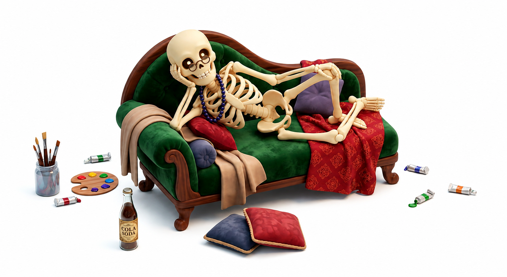

<div align="center">
  

<i>❝Ossa loquuntur, dum carnem expectamus.❞</i>
<br />
<sub>The bones speak while we wait for the flesh.</sub>

[](https://github.com/Wildhoney/Bonework/actions/workflows/checks.yml)

</div>

> Minimal-effort skeleton loaders for React &mdash; wrap what you already render, and CSS Anchor Positioning keeps shimmers aligned to the real DOM. No sizing props, no skeleton stand-ins, no drift as your UI evolves.

> **[View Live Demo →](https://wildhoney.github.io/Bonework/)**

## Contents

1. [Getting started](#getting-started)
1. [Palette](#palette)
1. [Placeholder](#placeholder)
1. [Levels](#levels)
1. [Recipes](#recipes)

For advanced topics, see the [recipes directory](./recipes/).

## Getting started

Install, wrap what you already render, and flip `skeleton` while data is loading. `useBonework()` inside lets descendants render safe fallbacks that vanish when real data lands:

```sh
pnpm add bonework
```

```tsx
import { Bonework, useBonework } from "bonework";

const aed = new Intl.NumberFormat("en-AE", {
  style: "currency",
  currency: "AED",
});

function Balance({ amount }: { amount: number | null }) {
  const bonework = useBonework();
  const formatted = amount != null ? aed.format(amount) : null;
  return <span>{bonework.placeholder(formatted, aed.format(0))}</span>;
}

export function Wallet({ data }: { data: Wallet | null }) {
  return (
    <Bonework skeleton={!data}>
      <h1>{data?.name ?? "Placeholder name"}</h1>
      <Balance amount={data?.balance ?? null} />
    </Bonework>
  );
}
```

Two moving parts. `<Bonework>` wraps the real UI and paints shimmers over it via CSS Anchor Positioning while `skeleton` is `true`. `useBonework()` reads that state so descendants render fallbacks (`placeholder(actual, fallback)`) that vanish once the skeleton drops.

## Palette

Bonework ships a neutral default (`{ bone: "#e5e7eb", highlight: "#f3f4f6" }`), so you can drop it in without wiring anything. Pass `palette` to align the shimmer with your design tokens &mdash; `bone` is the still band, `highlight` is the sweep:

```tsx
<Bonework
  skeleton
  palette={{
    bone: theme.colour.surface.muted,
    highlight: theme.colour.surface.bold,
  }}
>
  ...
</Bonework>
```

The default is exported as `defaultPalette` if you want to spread over it.

## Placeholder

`useBonework()` returns `{ skeleton, placeholder }`. `placeholder(actual, fallback)` handles the common trap where a hard-coded default (`data.balance ?? 0`) leaks past resolution:

| `actual`             | `skeleton` | Returns    |
| -------------------- | ---------- | ---------- |
| present              | either     | `actual`   |
| `null` / `undefined` | `true`     | `fallback` |
| `null` / `undefined` | `false`    | `null`     |

Outside a `<Bonework>` the hook is still safe: `placeholder` just returns `actual ?? null`.

## Levels

By default a single shimmer paints over each direct child. For composed layouts &mdash; a row, a card &mdash; you usually want each _leaf_ shimmering separately while wrapper gaps stay intact. Increase `levels`:

```tsx
<Bonework skeleton palette={tokens} levels={2}>
  <div className="row">
    
    <div>
      <strong>Name</strong>
      <p>Subline</p>
    </div>
  </div>
</Bonework>
```

`levels={1}` anchors the row. `levels={2}` anchors `` and the inner `<div>`. Bump it further to descend deeper.

## Recipes

- [Tuning](./recipes/tuning-overlay.md) &mdash; `radius`, `duration`, palette wiring.
- [Testing](./recipes/testing.md) &mdash; asserting on anchored elements and testing the hook.
- [Browsers](./recipes/browser-support.md) &mdash; support matrix and progressive-enhancement notes.
- [API](./recipes/api.md) &mdash; full type reference.
